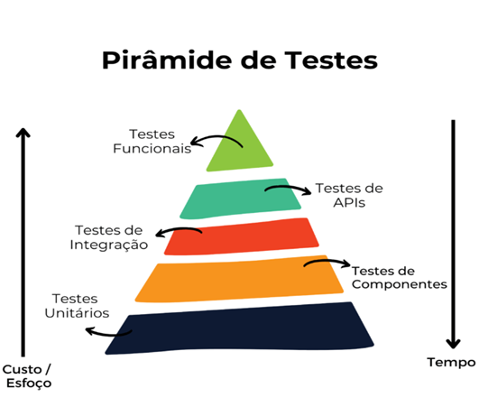

# Camadas da Pirâmide de Testes

Principais vantagens da pirâmide de teste:

- Detecção precoce de problemas: 

    Os testes de unidade identificam erros rapidamente, permitindo correções imediatas.

- Custo e tempo eficientes: 

    A base da pirâmide (testes de unidade) é a mais ampla e mais rápida de executar, enquanto a ponta é a menor. Isso ajuda a economizar tempo e recursos.

- Maior confiabilidade: 

    Testar em níveis mais baixos (testes de unidade e de integração) ajuda a garantir que as unidades individuais e os componentes funcionem corretamente antes de integrá-los em sistemas maiores.

- Feedback contínuo: 

    Os testes de unidade fornecem feedback constante para os desenvolvedores durante o processo de desenvolvimento.

- Cobertura abrangente: 

    A pirâmide de teste incentiva uma cobertura de teste completa, abordando diferentes aspectos da qualidade do software.

## Tipos de Testes

[Testes de Unidade (Unit Tests)](./unit-test.md)

[Teste de Componentes ()](./componet-test.md)

[Testes de Integração (Integration Tests)](./integraion-test.md)

[Teste de APIs (APIs Test)](./api-test.md)

[Testes de Aceitação (Acceptance Tests)](./acceptance-tests.md)

## Conclusão

Em resumo, a pirâmide de teste é um guia valioso para estruturar sua estratégia de automação de testes, priorizando testes de unidades, testes de integração e testes de aceitação de maneira hierárquica, eficiente e eficaz. Isso ajuda a manter a qualidade do software, detectar problemas precocemente e fornecer confiabilidade aos sistemas em desenvolvimento.